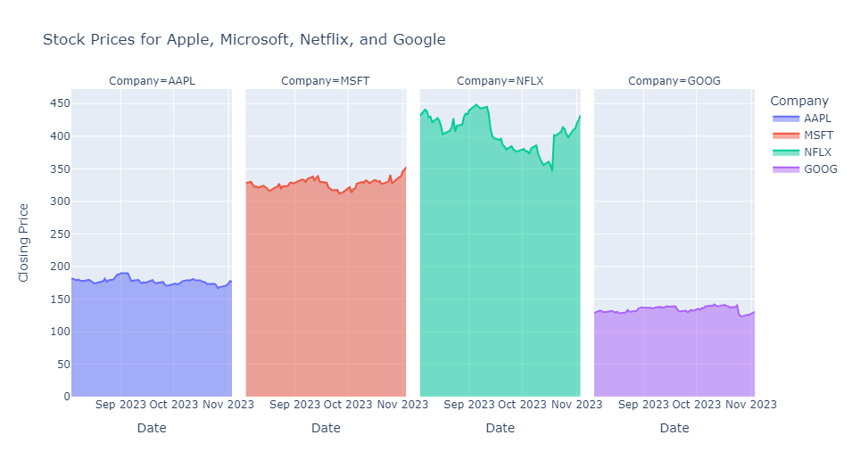
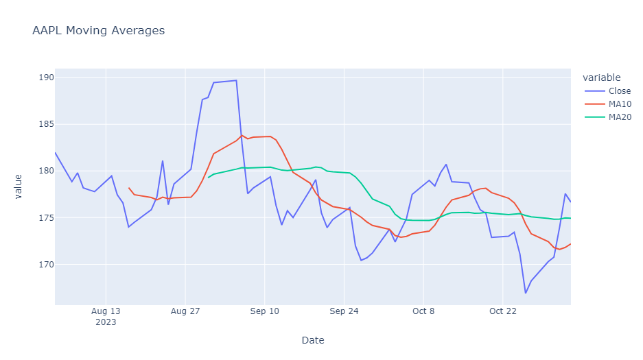
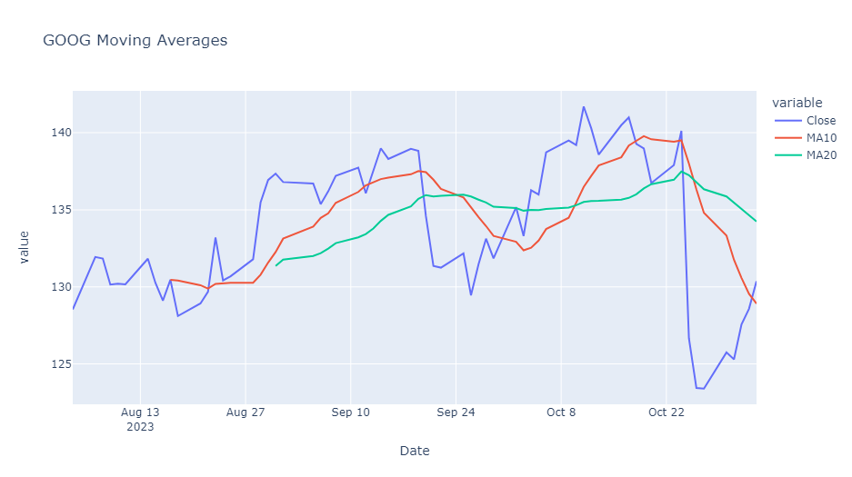
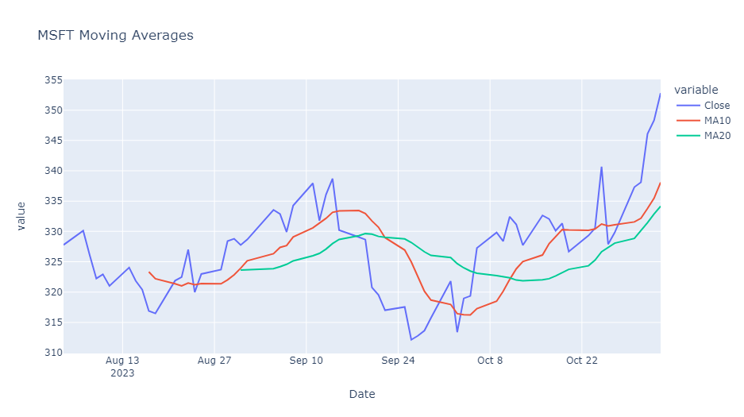
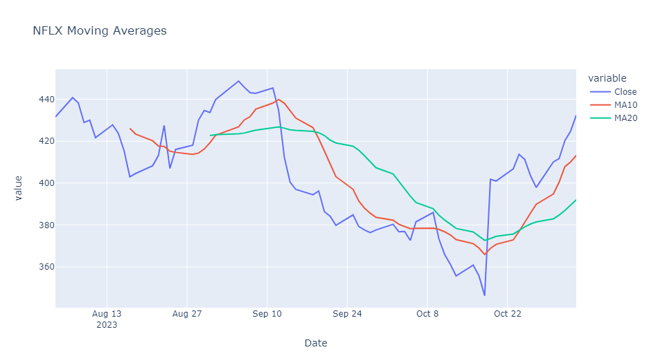
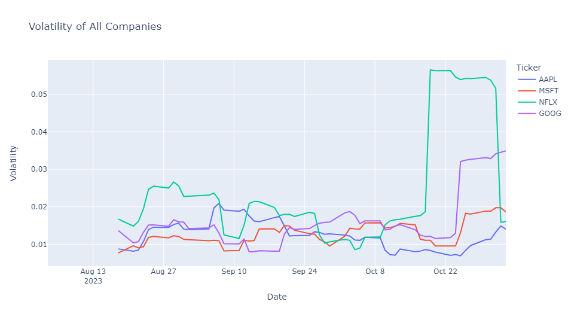
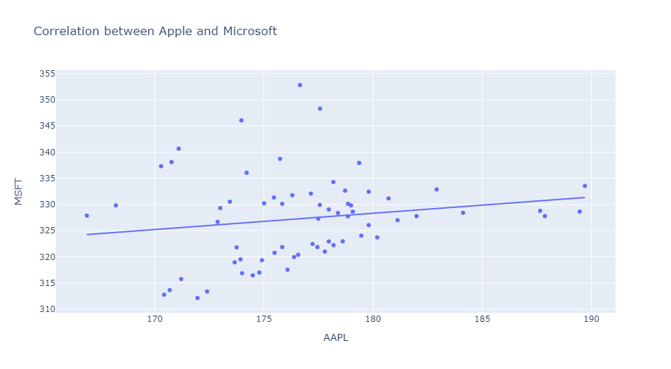

# Stock-Market-Performance-Analysis
### Overview
Stock Market Performance Analysis is a comprehensive data science project aimed at assisting investment professionals in making informed decisions about stock investments. This project involves collecting historical stock price data from reliable sources such as Yahoo Finance, visualizing the data through captivating charts, and conducting various analyses to identify potential opportunities and risks in the stock market.

<p align="center">
  
</p>

### Project Structure
The project is implemented using Python and utilizes popular libraries such as pandas, yfinance, datetime, and plotly express. The code snippet below demonstrates a structured process of stock market performance analysis:
```python
#import necessary modules
import pandas as pd
import yfinance as yf
from datetime import datetime
import plotly.express as px

#Collect the real-time stock market data using the yfinance API
start_date=datetime.now()-pd.DateOffset(months=3)
end_date=datetime.now()
tickers =['AAPL', 'MSFT', 'NFLX', 'GOOG']
df_list=[]
for ticker in tickers:
    data=yf.download(ticker, start=start_date, end=end_date)
    df_list.append(data)
df=pd.concat(df_list, keys=tickers, names=['Ticker', 'Date'])
print(df.head())
df=df.reset_index()
print(df.head())

#Performance Different Companies In Stock Market
fig=px.line(df,x='Date',
           y='Close',
           color='Ticker',
           title="Stock Market Performance for The last 3 Months")
fig.show()

#Faceted Area Chart
fig=px.area(df, x='Date', y='Close', color='Ticker',
              facet_col='Ticker',
              labels={'Date':'Date', 'Close':'Closing Price', 'Ticker':'Company'},
              title='Stock Prices for Apple, Microsoft, Netflix, and Google')
fig.show()

#Analyze the Moving Average
df['MA10']= df.groupby('Ticker')['Close'].rolling(window=10).mean().reset_index(0,drop=True)
df['MA20']=df.groupby('Ticker')['Close'].rolling(window=20).mean().reset_index(0,drop=True)

for ticker, group in df.groupby('Ticker'):
    print(f'Moving Averages for{ticker}')
    print(group[['MA10', 'MA20']])
df['Volatility']=df.groupby('Ticker')['Close'].pct_change().rolling(window=10).std().reset_index(0,drop=True)
fig=px.line(df, x='Date', y='Volatility',
           color='Ticker',
           title='Volatility of All Companies')
fig.show()


#create a DateFrame with the stock prices of Apple and Microsoft
apple=df.loc[df['Ticker']=='AAPL', ['Date', 'Close']].rename(columns={'Close':'AAPL'})
microsoft=df.loc[df['Ticker']=='MSFT', ['Date', 'Close']].rename(columns={'Close':'MSFT'})
df_corr=pd.merge(apple, microsoft, on='Date')

#create a scatter plot to visualize the correlation
fig=px.scatter(df_corr, x='AAPL', y='MSFT',
              trendline='ols',
              title='Correlation between Apple and Microsoft')
fig.show()
```
The code covers tasks such as downloading historical stock data, visualizing stock prices using line and area charts, calculating moving averages and volatility, and performing correlation analysis.

### Usage
1. __Install Required Libraries:__
   
    Ensure that you have the required libraries installed. You can install them using the following:
   
   ``` pip install pandas yfinance plotly ```
   
2. __Run the Code:__

   Copy and run the provided Python code in your preferred development environment.

3. __Explore the Results:__

   Visualize the stock market performance over the last 3 months, observe moving averages, and analyze the correlation between selected companies.

### Example Visualizations
### Stock Price Over Time


### Moving Average





### Volatility Analysis


### Correlation between Apple and Microsoft



   
   
